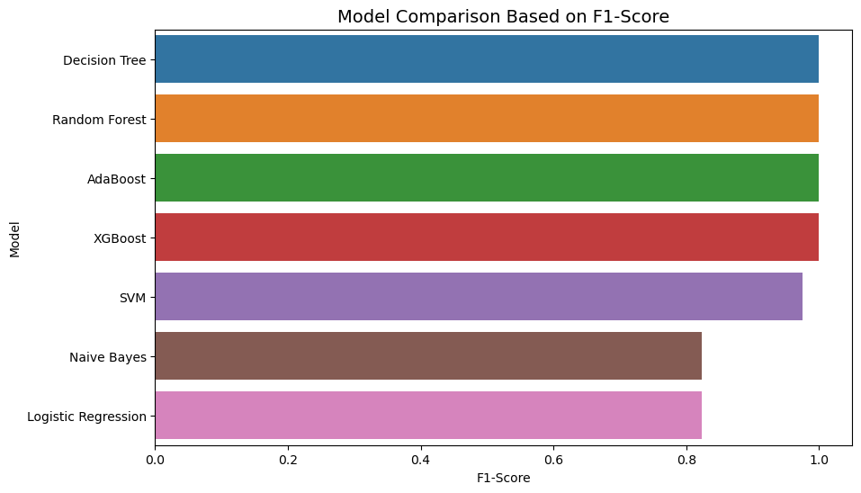
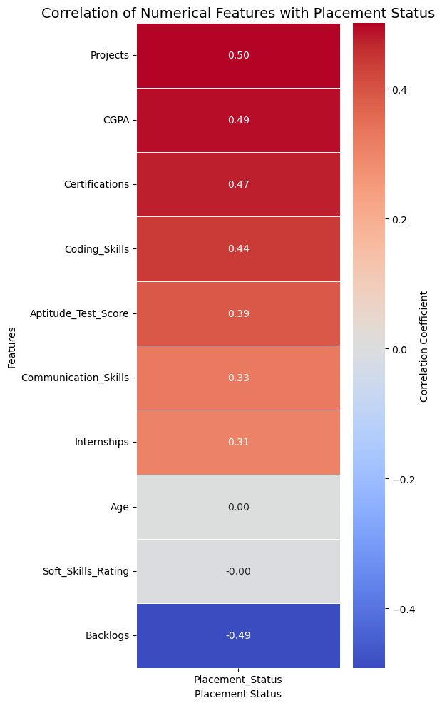
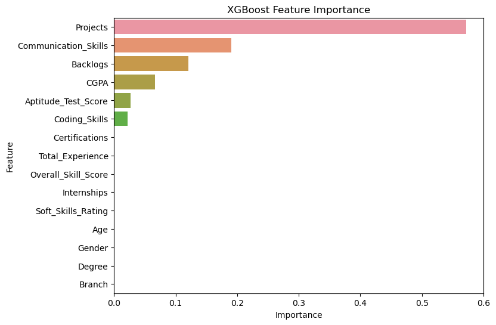
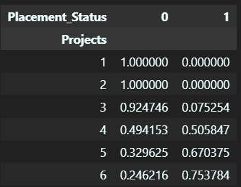
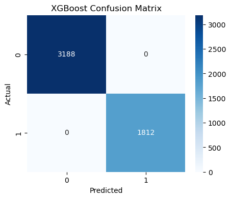

# 🎓 Student Placement Prediction using Machine Learning

## 📌 Project Overview

This project aims to predict whether a student will be placed during campus recruitment based on academic performance, technical skills, internships, projects, aptitude score, certifications, communication skills, and other related attributes.

Multiple machine learning algorithms were trained and compared to identify the best-performing model.

The project follows a complete end-to-end machine learning workflow including:

* Data inspection
* Data cleaning
* Exploratory Data Analysis (EDA)
* Feature engineering
* Feature encoding and preprocessing
* Model building
* Model evaluation
* Model comparison
* Feature importance analysis
* Performance interpretation

---

## 📂 Dataset

**Dataset:** Student Placement Dataset


**Dataset Link:** https://www.kaggle.com/datasets/sonalshinde123/student-placement-dataset


* Total records: 50,000
* Training samples: 45,000
* Test samples: 5,000
* Target variable:

| Value | Meaning    |
| ----- | ---------- |
| 0     | Not Placed |
| 1     | Placed     |

### Features

| Feature              | Description                  |
| -------------------- | ---------------------------- |
| Age                  | Student age                  |
| Gender               | Gender                       |
| Degree               | Degree program               |
| Branch               | Specialization               |
| CGPA                 | Academic performance         |
| Internships          | Number of internships        |
| Projects             | Number of projects completed |
| Coding_Skills        | Coding skill rating          |
| Communication_Skills | Communication skill rating   |
| Aptitude_Test_Score  | Aptitude score               |
| Soft_Skills_Rating   | Soft skills rating           |
| Certifications       | Number of certifications     |
| Backlogs             | Number of backlogs           |
| Placement_Status     | Target variable              |

---

# Workflow

```
Data Loading
     ↓
Data Inspection
     ↓
Data Cleaning
     ↓
Exploratory Data Analysis
     ↓
Feature Engineering
     ↓
Encoding and Scaling
     ↓
Model Building
     ↓
Model Evaluation
     ↓
Model Comparison
     ↓
Feature Importance Analysis
```

---

# Feature Engineering

Two new features were created:

### Total_Experience

Combines:

* Internships
* Projects
* Certifications

```
Total_Experience =
Internships + Projects + Certifications
```

---

### Overall_Skill_Score

Combines:

* Coding Skills
* Communication Skills
* Soft Skills Rating

```
Overall_Skill_Score =
Coding_Skills + Communication_Skills + Soft_Skills_Rating
```

---

# Models Used

The following classification algorithms were trained and evaluated:

1. Logistic Regression
2. Support Vector Machine (SVM)
3. Gaussian Naive Bayes
4. Decision Tree
5. Random Forest
6. AdaBoost
7. XGBoost

---

# Evaluation Metrics

The models were evaluated using:

* Accuracy
* Precision
* Recall
* F1 Score
* ROC-AUC Score
* Classification Report
* Confusion Matrix

---

# Exploratory Data Analysis

Several exploratory analyses were performed to understand the relationships among features and placement outcomes.

Examples include:

* Distribution of numerical features
* Distribution of categorical features
* Correlation analysis
* Placement rate by project count
* Influence of CGPA and coding skills on placement
* Impact of aptitude score on placement
* Relationship between backlogs and placement
* Feature importance analysis

---

# Results

| Model               | Accuracy |
| ------------------- | -------: |
| Decision Tree       |   1.0000 |
| Random Forest       |   1.0000 |
| AdaBoost            |   1.0000 |
| XGBoost             |   1.0000 |
| SVM                 |   0.9822 |
| Logistic Regression |   0.8722 |
| Naive Bayes         |   0.8614 |

---

# Model Performance Comparison



---

# Correlation Heatmap



---

# XGBoost Feature Importance



---

# Placement Probability by Number of Projects



---

# XGBoost Confusion Matrix



---

# Feature Importance Findings

XGBoost feature importance analysis revealed:

1. Projects was the most influential feature.
2. Communication skills contributed significantly.
3. Backlogs played an important role.
4. Academic indicators such as CGPA and aptitude score had moderate influence.
5. Features such as Age, Gender, Degree, and Branch contributed very little.

---

# Key Insight

Cross-tabulation between the number of projects and placement status showed a strong relationship.

| Projects | Not Placed | Placed |
| -------- | ---------- | ------ |
| 1        | 100%       | 0%     |
| 2        | 100%       | 0%     |
| 3        | 92.47%     | 7.53%  |
| 4        | 49.42%     | 50.58% |
| 5        | 32.96%     | 67.04% |
| 6        | 24.62%     | 75.38% |

Tree-based algorithms such as Decision Tree, Random Forest, AdaBoost, and XGBoost excel at learning rule-based relationships. Since the synthetic dataset contains strong logical dependencies, these models were able to learn the underlying decision boundaries almost perfectly, resulting in 100% performance on the test set.

This behavior suggests that the dataset is highly separable and easier to classify than real-world placement datasets.

---

# Technologies Used

### Programming Language

* Python

### Libraries

* NumPy
* Pandas
* Matplotlib
* Seaborn
* Scikit-learn
* XGBoost

---

# Repository Structure

```
Student-Placement-Prediction
│
├── data/
│   ├── train.csv
│   └── test.csv
│
├── Images/
│
├── student_placement_prediction.ipynb
│
├── requirements.txt
└── README.md
```

---

# Conclusion

An end-to-end machine learning pipeline was developed to predict student placement outcomes.

Among the evaluated models, tree-based ensemble methods demonstrated superior performance. Feature importance analysis showed that project experience, communication skills, and backlog count were the most influential predictors.

Because the dataset is synthetically generated with strong logical relationships, ensemble models achieved perfect classification performance. Therefore, the obtained results should be interpreted with caution and may not fully represent the complexity of real-world placement prediction tasks.
